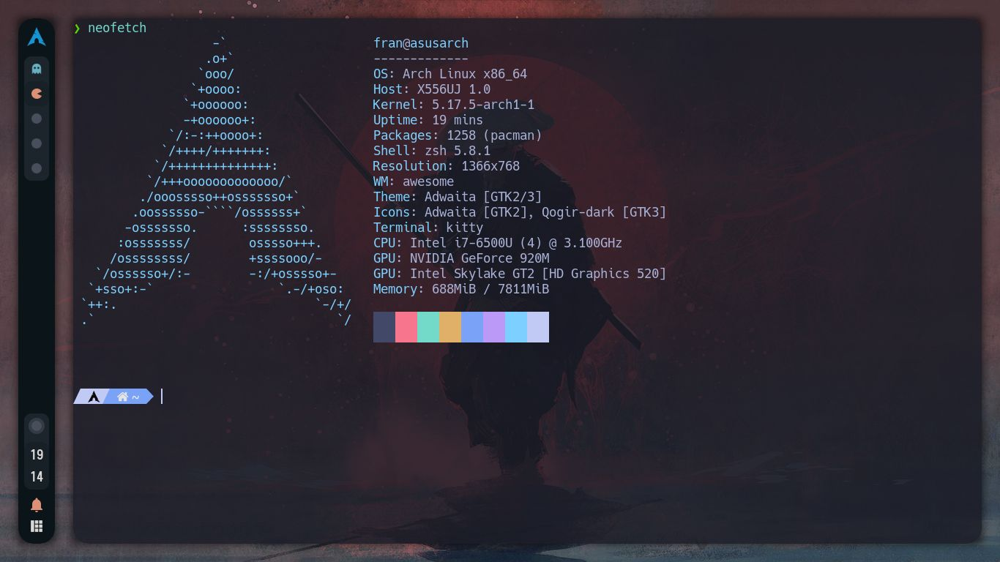
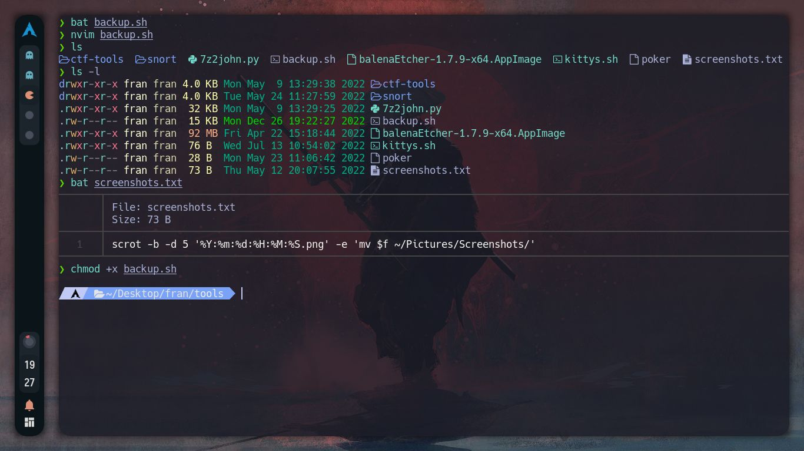
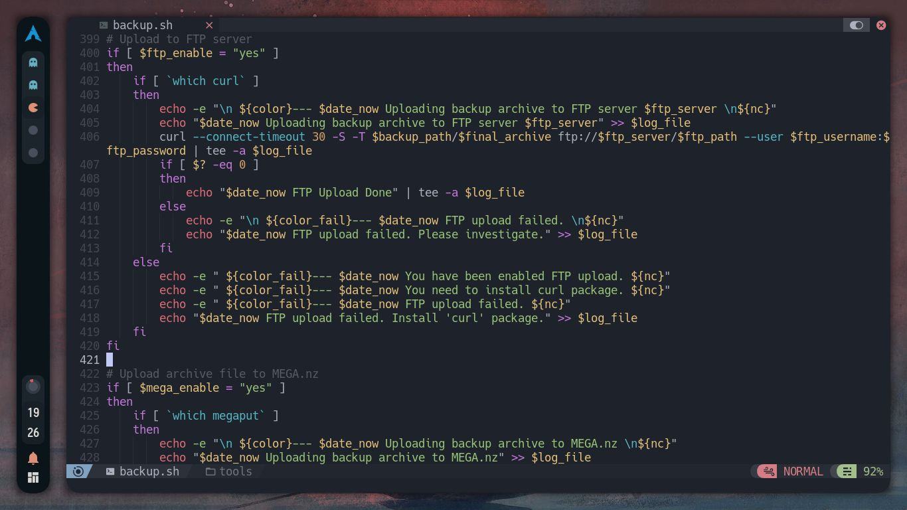

# Install Awesome and config
 This script will autoinstall Awesome Desktop with all the dependences and setup my config

# Screenshots

# Apps

| Programs   | Using             |
| ---------- | ----------------- |
| WM         | awesome-git       |
| OS         | arch linux        |
| Terminal   | kitty             |
| Shell      | zsh               |
| Editor     | neovim / gedit    |
| Compositor | picom             |
| Launcher   | rofi              |

# Keybindings

| Key                 | Action                          |
| ------------------- | --------------------------------|
| **mod + return**    | launch terminal (kitty)         |
| **mod + shift + f** | launch browser (firefox)        |
| **mod + e**         | launch file explorer (nautilus) |
| **mod + x**         | screenshot (scrot)              |
| **mod + shift + g** | text editor (gedit)             |

